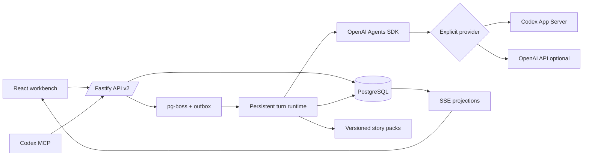

# Architecture

## Commit boundary

Director emits candidate changes. Continuity, Stage, Agency, Character and Pack reviewers run before the transaction. The committer rechecks the captured configuration/stage revisions, validates milestone evidence, applies state changes, resolves candidate-change references to actual fact IDs, and writes the scene and stage snapshots atomically. A stale revision causes context assembly and planning to repeat, at most three attempts.

Narrator receives committed public events and public character/history summaries. Polish receives only its draft and preservation rules. Deterministic checks cover selected numeric, identity, polarity, ownership, state and certainty anchors. Critical scenes and suspected conflicts use one semantic call comparing draft and candidate. A rejected polish can fall back to an approved draft; a rejected draft gets one repair and recheck, then a conservative public-event summary. Persisted narration state supports recovery; SSE includes only published prose. Narration-only retries preserve scene IDs, options, events, clock and world hashes.

## Context policy

Director and reviewers receive the arc objective/stakes, story clock, current stage, prior settlement outcomes, relations, 24 recent facts and eight published summaries. Exact IDs referenced by relationships, milestones and failures supplement older evidence in a separate deduplicated section. Character reviewers receive their own private profile and relevant relationships. Narration/verifier prompts contain no private character profiles, arc plans, stage targets or advanced prompts. Role-specific data is separated using XML sections.

## Choices and concurrency

Each story is locked before its turn rows, with one `running_turn_id`. Choices use a stable scene-scoped option ID and persisted decision ID. Confirming a decision locks the story and atomically records its resolution, one choice fact, one continuation turn and one outbox item. Retries return the same continuation; stale or changed requests return HTTP 409. Free text while waiting resolves the same decision. Critical continuation turns precede older queued ordinary input; ordinary queued input retains receipt order.

The Agency review binds a confirmed action to covered change indices. New major actions stop at another decision. Manual actions pause autoplay. A choice continuation has a manual source and never chains autoplay. Autoplay accounting and next-turn insertion are atomic and recoverable, including the crash window after turn completion. Explicit resume is required after choices, stage extension or next-stage confirmation.

## Milestones and deadlines

Each completion criterion maps to a stable stage-scoped milestone ID. All are required and equally weighted; progress is the achieved count divided by the total. Stage Agent returns evidence references using existing fact IDs or current candidate indices in its existing review call. Scene objectives, progress metadata and completion announcements are inadmissible evidence. Repeated evaluation of an achieved milestone does not increment progress.

The Director receives a duration limit and any scheduled duration before writing a plan. The runtime repairs or rejects violations instead of trimming an already-generated scene. `deadlineMinutes` is an absolute story time. Expiry creates an `awaitingDeadline` issue, pauses autoplay and blocks actions until extension or closure. Closure records partial/abandoned status at the actual progress; an evidenced failure records failure; all milestones reached records success. Next stages require confirmation and retain prior unresolved criteria. The final settlement sets story status to `finished`.

## Migration and replay

Version 2 adds decisions, request receipts, narration attempts and versioned backup tables. Before migrating each old save, write a filesystem and database snapshot. Migration runs under a story transaction and appends a replayable migration snapshot. Old completed stages keep their historical verdicts; unfinished percentages remain historical metadata. No old resolved choice receives a new continuation.

Stage snapshots include milestone evidence, deadline, outcome and failure evidence. Hash replay reconstructs character/relationship projections, stage snapshots, decisions, story status and time. Mutable narration is deliberately excluded from world hashes, so retrying prose can be verified without treating it as a new action.

## Story packs

The kernel knows time, locations, characters, relationships, facts, scenes and stages. Packs contribute prompts and deterministic plan validators; domain-specific cultivation, magic, combat or economy remain in separately versioned packs.

## Experience schema 3–7

`experience-store.ts` owns Chinese lexical/entity retrieval, cited threads, resumable indexing, versioned backups and compressed checkpoints. `archive.ts` validates and remaps a snapshot into an isolated save without dispatching history; `checkpoint-rebuild.ts` folds a proven initialization/event prefix for historical forks.

`branches.ts` validates a bounded DAG and evaluates evidence-backed route conditions. `resources.ts` computes registered quotes, deterministic d20 outcomes, consumption and item transfer; `resource-store.ts` freezes the result before review and commits it atomically. `npc-store.ts` separates personal knowledge from truth and limits scheduled subjects, enforcing warning windows for irreversible consequences.

Low-risk plans can use a combined review with full-review escalation. Narrative claims bind to actual public paragraphs and source facts. Configuration, graph, full character profiles and experience projections participate in replay hashes; prose remains excluded from world hashes. See FIVE_BATCH_EXPERIENCE.md for the current contracts and limited template scope.
