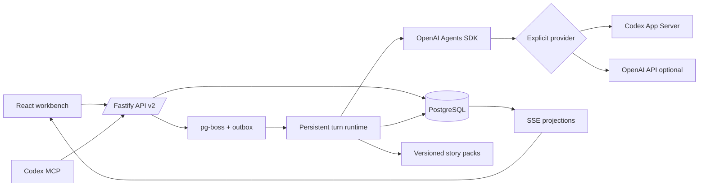

# Architecture

## Commit boundary

Agents cannot write database state. Director returns `ScenePlan`; reviewers return `AgentReview`. After all checks pass, the transaction committer applies the allowlisted `StateChange` union and emits canonical facts with structured payloads and source IDs. Narrator then reads the committed projection and creates prose. A crash before commit safely repeats planning; a crash after commit resumes at narration or summarization without another scene insert.

## Context policy

The composer includes immutable engine rules, world config, versioned advanced Prompt, story packs, current stage, character records, up to eight scene summaries, up to 24 relevant facts, current input and output Schema. The protagonist and core cast always receive compact state. Only present characters receive private profile, drives and fears.

## Concurrency

Each branch has `running_turn_id`, so only one mutating turn commits at once. Manual and MCP turns are persisted with idempotency keys and queued by server receipt order. Dynamic Character Agents and rule reviewers use a four-worker concurrency limit. The outbox prevents a committed API request from losing its queue job, and startup recovery re-dispatches interrupted turns.

## Story packs

The kernel knows only time, location, characters, relationships, facts, scenes and stages. A pack contributes a prompt layer and deterministic plan validators. Domain systems such as cultivation, magic, combat or economy belong in separately versioned packs.
